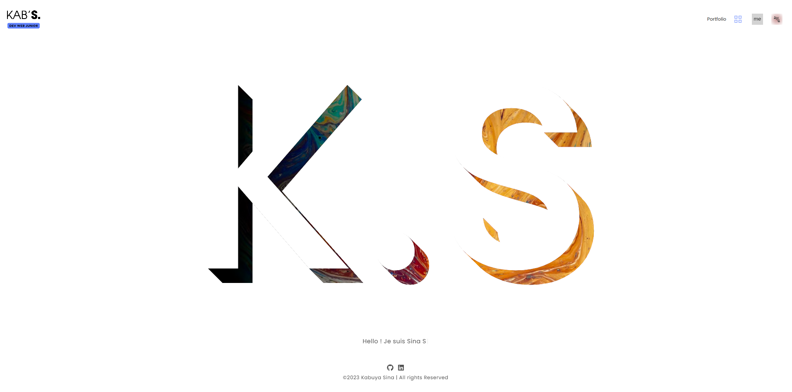
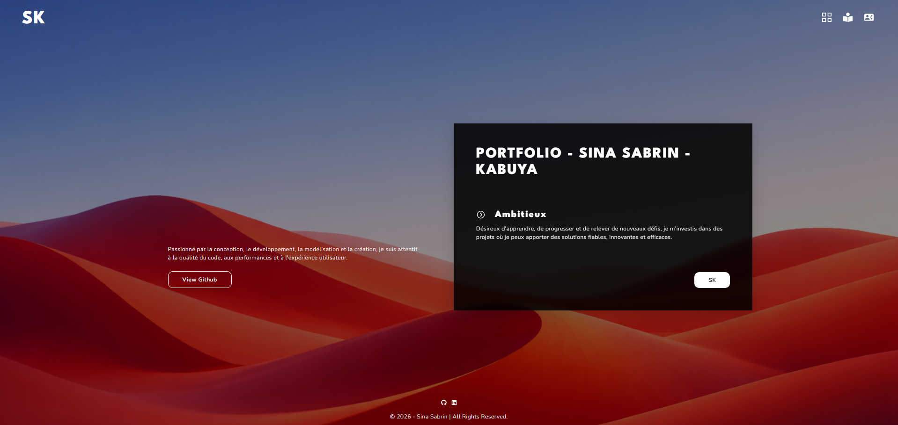

# 💼 Personal Portfolio – React

  
  
      

A modern, responsive, and performant developer portfolio built with React.
Designed to showcase my skills, projects, and engineering mindset as a developer.

---

## 🚀 Live Demo

```
👉 https://github.com/KABUYA-SINA
```

---

## 🖼️ Preview




---

## ⚡ Lighthouse Score

| Performance | Accessibility | Best Practices | SEO |
| ----------- | ------------- | -------------- | --- |
| 80+         | 97+           | 100            | 100 |

---

## 🧑‍💻 About the Project

This portfolio was built to present my development projects, technical skills, and UI/UX approach.
It demonstrates my ability to build scalable, maintainable, and performant React applications using modern frontend practices.

---

## 🛠️ Tech Stack

Frontend: React (CRA), React Router DOM, JavaScript (ES6+), SASS
Tools: React Icons, Git, GitHub, GitHub Pages, React Lazy/Suspense

---

## 🏗️ Architecture

```bash
src
├── components      # Reusable UI components
├── pages           # Application pages
├── hooks           # Custom React hooks
├── data            # Static project data
├── sass            # Styling (SASS architecture)
├── assets          # Images & static files
│
├── App.js          # Routing configuration
├── index.js        # Entry point
```

---

## 🎯 Features

- Component-based architecture
- Lazy-loaded routes for performance optimization
- Clean routing with React Router v6
- Accessible navigation (ARIA support)
- Modular SASS architecture
- Projects showcase system
- External links (GitHub / LinkedIn)
- Optimized UX structure

---

## 🚀 Performance Highlights

- Code splitting with React Lazy Loading
- Optimized bundle size
- Fast initial load time
- Clean component separation
- Minimal unnecessary re-renders

---

## 🎨 UI / UX Highlights

- Minimalist design approach
- Icon-based navigation
- Smooth user flow between pages
- Consistent spacing and typography
- Mobile-first responsive layout

---

## ⚙️ Installation & Setup

```
git clone https://github.com/KABUYA-SINA/Portfolio-SK.git
```

```
npm install
```

```
npm start
```

---

## 🌐 Deployment (GitHub Pages)

```
npm run build
npm run deploy
```

---

## 📊 Project Status

```
✔ Completed
✔ Responsive
✔ Production-ready
✔ Deployed on GitHub Pages
```

---

## 👤 Author

Sina Sabrin
Developer

GitHub: https://github.com/KABUYA-SINA

---

## ⭐ Notes for Recruiters

This project demonstrates:

- Clean code architecture
- Strong React fundamentals
- Performance optimization mindset
- UI/UX attention to detail
- Production-ready frontend structure

---
